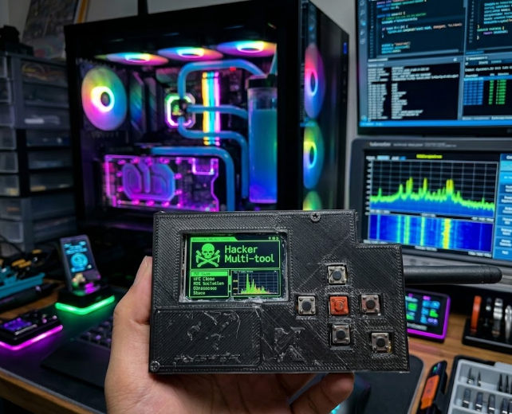

<div align="center">

# DIY Flipper Zero with STM32WB55

[](LICENSE)
[](https://www.st.com/en/microcontrollers-microprocessors/stm32wb55cg.html)
[](https://github.com/Next-Flip/Momentum-Firmware)
[]()

**A cheap and affordable alternative to the original Flipper Zero, built from scratch.**

Focused on embedded systems, RF modules, and custom firmware — for learning and educational purposes.



*DIY Flipper Zero — Hacker Multi-tool built with STM32WB55*

</div>

---

## Table of Contents

- [Features](#features)
- [Hardware Used](#hardware-used)
- [Software Prerequisites](#software-prerequisites)
- [Step-by-Step Build Guide](#step-by-step-build-guide)
  - [Step 1: Install STM32CubeProgrammer](#step-1-install-stm32cubeprogrammer)
  - [Step 2: Enter Boot Mode and Connect](#step-2-enter-boot-mode-and-connect)
  - [Step 3: Flash First OTP](#step-3-flash-first-otp)
  - [Step 4: Flash Second OTP](#step-4-flash-second-otp)
  - [Step 5: Install Firmware with qFlipper](#step-5-install-firmware-with-qflipper)
  - [Step 6: Install Custom Firmware (Momentum)](#step-6-install-custom-firmware-momentum)
  - [Step 7: Prepare the Micro SD Card](#step-7-prepare-the-micro-sd-card)
  - [Step 8: Connect the Micro SD Module](#step-8-connect-the-micro-sd-module)
  - [Step 9: Verify SD Card in qFlipper](#step-9-verify-sd-card-in-qflipper)
  - [Step 10: Connect the ST7565 LCD Display](#step-10-connect-the-st7565-lcd-display)
  - [Step 11: Connect the Buttons](#step-11-connect-the-buttons-controls)
  - [Step 12: Portable Power Supply](#step-12-portable-power-supply)
  - [Step 13: Connect the CC1101 Module](#step-13-connect-the-cc1101-sub-ghz-module)
- [Full Pinout Summary](#full-pinout-summary)
- [OTP Configuration](#otp-configuration)
- [Repository Structure](#repository-structure)
- [Contributing](#contributing)
- [Disclaimer](#disclaimer)
- [License](#license)

---

## Features

- Sub-GHz RF communication via **CC1101** module
- **128x64 ST7565 LCD** display with backlight
- **Micro SD** card support for apps, assets, and configurations
- **6-button D-pad** control (Up, Down, Left, Right, OK, Back)
- **Portable**: powered by Li-Po 3.7V battery with MT3608 boost converter
- Runs **Momentum** custom firmware (based on Flipper Zero firmware)
- **BLE 5.0** support via STM32WB55 built-in radio

---

## Hardware Used

| Component | Description | Qty |
|-----------|-------------|:---:|
| STM32WB55CGU6 board | Main microcontroller with BLE 5.0 | 1 |
| CC1101 Module | Sub-GHz RF transceiver | 1 |
| 1.4" 128x64 ST7565 LCD | Display (12864COG) | 1 |
| Micro SD Card Module | SPI SD card reader | 1 |
| Push Buttons | Tactile switches for D-pad + Back | 6 |
| Li-Po Battery 3.7V | Rechargeable power source | 1 |
| TP4056 Charge Module | Battery charging circuit | 1 |
| MT3608 Boost Converter | DC-DC step-up to ~5.1V | 1 |
| Power Switch | On/Off toggle | 1 |
| Micro SD Card | FAT32 formatted | 1 |

---

## Software Prerequisites

### 1. STM32CubeProgrammer

Tool used to flash the OTP data onto the STM32WB55.

| | |
|---|---|
| **Version** | 2.22.0 (Win64) |
| **Download** | [STM32CubeProgrammer - st.com](https://www.st.com/en/development-tools/stm32cubeprog.html) |

> **Note**: You need to create a free account on st.com to download this software.

### 2. qFlipper

Desktop application for firmware installation and device management.

| | |
|---|---|
| **Download** | [Flipper Downloads Page](https://flipper.net/pages/downloads) |
| **Platforms** | Windows / macOS / Linux |

---

## Step-by-Step Build Guide

### Step 1: Install STM32CubeProgrammer

1. Go to [st.com/en/development-tools/stm32cubeprog.html](https://www.st.com/en/development-tools/stm32cubeprog.html)
2. Create an account or log in
3. Download **STM32CubePrg-W64** version 2.22.0 (for Windows 11)
4. Run the installer and follow the setup wizard

### Step 2: Enter Boot Mode and Connect

1. On the STM32WB55 board, **press and hold the BOOT button**
2. While holding BOOT, **connect the board to your PC via USB**
3. Open **Device Manager** (`Win + X` > Device Manager) and verify the device appears correctly under USB devices
4. Open **STM32CubeProgrammer**
5. Click the **blue dropdown button** (top-left corner) and select **USB**
6. In the **Port** section below, click the **refresh button** (next to the port field) to detect the device
7. Click **Connect** (next to the blue USB button)

### Step 3: Flash First OTP

1. Once connected, click the **download icon** (left sidebar — "Erasing & Programming" section)
2. In **File Path**, browse and select: `DIY Flipper/OTP/First_otp.bin`
3. In **Start Address**, enter: `0x1FFF7000`
4. Click **Start Programming**
5. Wait for the confirmation message

### Step 4: Flash Second OTP

1. In the same programming section, change the **File Path** to: `DIY Flipper/OTP/Second OTP.bin`
2. In **Start Address**, change to: `0x1FFF7010`
3. Click **Start Programming**
4. Wait for the confirmation message

### Step 5: Install Firmware with qFlipper

1. **Disconnect** the STM32WB55 board from USB
2. **Press and hold the BOOT button** on the board
3. While holding BOOT, **reconnect the board to USB**
4. Open the **qFlipper** application
5. Wait for qFlipper to recognize the controller
6. Click **Repair** in qFlipper
7. Wait for the firmware to download and install

### Step 6: Install Custom Firmware (Momentum)

1. Once the repair finishes, click **Install from file** (at the bottom of the Repair button)
2. Browse and select: `DIY Flipper/Firmware/flipper-z-f7-full-mntm-momentum-75bfde09.dfu`
3. Wait for the installation to complete
4. When the **Continue** button appears, click it
5. **Disconnect** the controller from USB

### Step 7: Prepare the Micro SD Card

1. Insert the **Micro SD card** into your computer (using an adapter if needed)
2. **Format** the SD card as **FAT32**
3. Copy the entire contents of `DIY Flipper/SD Card/` to the root of the Micro SD card
4. Safely eject the SD card from your computer

### Step 8: Connect the Micro SD Module

Wire the Micro SD module to the STM32WB55 as follows:

| SD Module Pin | STM32WB55 Pin |
|:-------------:|:-------------:|
| VCC           | 3.3V          |
| CS            | PA4           |
| MOSI          | PB5           |
| SCK           | PB3           |
| MISO          | PB4           |
| GND           | GND           |

### Step 9: Verify SD Card in qFlipper

1. Connect the STM32WB55 board to your computer via USB
2. Open **qFlipper** — you should see **"SD Card 99% FREE"** displayed
3. This confirms the Micro SD module is wired correctly and the SD card contents are recognized
4. **Disconnect** the board from USB before continuing with the next connections

### Step 10: Connect the ST7565 LCD Display

Wire the 1.4" 128x64 ST7565 LCD (12864COG) to the STM32WB55:

| LCD Pin | Function                   | STM32WB55 Pin |
|:-------:|----------------------------|:-------------:|
| 1 CSB   | Enable signal (active low) | PB2           |
| 2 RSTB  | Reset (low level)          | PB0           |
| 3 A0/RS | Data/instruction select    | PB1           |
| 4 SCLK  | Serial clock               | PB3           |
| 5 SDA   | Serial data                | PB5           |
| 6 VDD   | Power supply +3.3V         | 3.3V          |
| 7 VSS   | Ground                     | GND           |
| 8 LEDA  | Backlight positive         | 3.3V          |

Once connected and powered, the Flipper interface should appear on the display.

### Step 11: Connect the Buttons (Controls)

6 buttons total: 5 arranged in a **D-pad cross** + 1 **Back** button.

```
          ┌───────┐
          │  UP   │
          │  PB8  │
          └───┬───┘
  ┌───────┐┌──┴────┐┌───────┐
  │ LEFT  ││  OK   ││ RIGHT │
  │  PB7  ││  PH3  ││  PA6  │
  └───────┘└──┬────┘└───────┘
          ┌───┴───┐
          │ DOWN  │           ┌───────┐
          │  PA5  │           │ BACK  │
          └───────┘           │  PA10 │
                              └───────┘
```

| Button | STM32WB55 Pin |
|:------:|:-------------:|
| Up     | PB8           |
| OK     | PH3           |
| Left   | PB7           |
| Right  | PA6           |
| Down   | PA5           |
| Back   | PA10          |

> All buttons share a common connection to **GND**.

### Step 12: Portable Power Supply

To make the device portable (independent from computer power), you need:

| Component | Purpose |
|-----------|---------|
| Li-Po Battery 3.7V | Power source |
| TP4056 Charge Module | Safe charging circuit |
| Power Switch | On/Off control |
| MT3608 Boost Converter | Step-up voltage to ~5.1V |

**Wiring chain:**

```
┌──────────┐    ┌────────────────┐    ┌────────┐    ┌────────────────────┐    ┌──────────┐
│ Li-Po    │───▶│ Charge Module  │───▶│ Switch │───▶│ MT3608 (~5.1V out) │───▶│ STM32    │
│ 3.7V     │    │ (TP4056)       │    │ ON/OFF │    │ Boost Converter    │    │ 5V + GND │
└──────────┘    └────────────────┘    └────────┘    └────────────────────┘    └──────────┘
```

1. Connect the **Li-Po battery** to the **charge module** input
2. Route the charge module output through a **power switch**
3. Connect the switch output to the **MT3608** boost converter input
4. **Adjust the MT3608** output to approximately **5.1V** (using the onboard potentiometer)
5. Connect the MT3608 output to the **5V pin** on the STM32WB55
6. Connect **GND** from the MT3608 to **GND** on the STM32WB55

### Step 13: Connect the CC1101 Sub-GHz Module

Wire the CC1101 RF module to the STM32WB55:

| CC1101 Pin | Function | STM32WB55 Pin |
|:----------:|----------|:-------------:|
| Pin 1      | GND      | GND           |
| Pin 2      | VCC      | 3.3V          |
| Pin 3      | GDO0     | PA1           |
| Pin 4      | CSN      | PA7           |
| Pin 5      | SCK      | PB3           |
| Pin 6      | MOSI     | PB5           |
| Pin 7      | MISO     | PB4           |

---

## Full Pinout Summary

| STM32WB55 Pin | Connected To |
|:-------------:|-------------|
| PA1  | CC1101 GDO0 |
| PA4  | SD Module CS |
| PA5  | Button Down |
| PA6  | Button Right |
| PA7  | CC1101 CSN |
| PA10 | Button Back |
| PB0  | LCD RSTB |
| PB1  | LCD A0/RS |
| PB2  | LCD CSB |
| PB3  | LCD SCLK / SD SCK / CC1101 SCK |
| PB4  | SD MISO / CC1101 MISO |
| PB5  | LCD SDA / SD MOSI / CC1101 MOSI |
| PB7  | Button Left |
| PB8  | Button Up |
| PH3  | Button OK |
| 3.3V | LCD VDD, LCD LEDA, SD VCC, CC1101 VCC |
| 5V   | MT3608 output |
| GND  | All modules & buttons |

---

## OTP Configuration

The STM32WB55 requires OTP (One-Time Programmable) data to be written before the firmware can run:

| OTP Region | Address | File |
|:----------:|:-------:|------|
| First OTP  | `0x1FFF7000` | `DIY Flipper/OTP/First_otp.bin` |
| Second OTP | `0x1FFF7010` | `DIY Flipper/OTP/Second OTP.bin` |

> **Warning**: OTP memory can only be written once. Double-check addresses and files before flashing.

---

## Repository Structure

```
DIY-Flipper-STM32/
├── DIY Flipper/
│   ├── Firmware/              # Momentum firmware (.dfu)
│   ├── OTP/                   # OTP binary files and addresses
│   └── SD Card/               # SD card contents (apps, assets, configs)
│       ├── apps/              # Flipper applications
│       ├── badusb/            # BadUSB scripts and layouts
│       ├── infrared/          # IR remote databases
│       ├── nfc/               # NFC assets and keys
│       ├── subghz/            # Sub-GHz captures and remotes
│       └── ...
├── img/                       # Project images
├── .gitignore
├── CHANGELOG.md
├── CONTRIBUTING.md
├── LICENSE
├── README.md
└── SECURITY.md
```

---

## Contributing

Contributions are welcome! Please read [CONTRIBUTING.md](CONTRIBUTING.md) before submitting a pull request.

---

## Disclaimer

> This project is for **educational purposes only**. I am not responsible for any misuse of this device or its capabilities. Always comply with local laws and regulations regarding RF transmission, NFC, RFID, and electronic devices. Unauthorized access to systems or networks is illegal.

---

## License

This project is licensed under the **GNU General Public License v3.0** — see the [LICENSE](LICENSE) file for details.

The Flipper Zero firmware is licensed under [GPLv3](https://github.com/flipperdevices/flipperzero-firmware/blob/dev/LICENSE) by Flipper Devices Inc.
